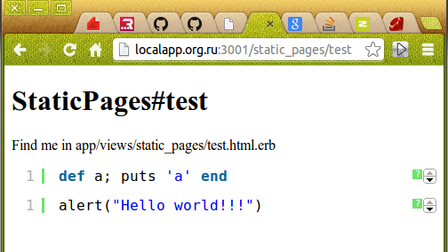

# acts_as_highlighter #

Distributed under the MIT License

- - -

#### Version ####

**Current: 0.0.2**

Note to the previous versions, see the end of this *README*

- - -

#### Plugin adds a javascript based syntax highlighting ####

The javascript library taken from here from [here](https://github.com/alexgorbatchev/SyntaxHighlighter). See [here](http://alexgorbatchev.com/SyntaxHighlighter) to details. The plugin does not support themes.

#### Install ####

add this line to the `Gemfile`:

```ruby
gem 'acts_as_highlighter', git: 'git://github.com/logrusorgru/acts_as_highlighter.git'
```

then run

```sh
bundle install
```

after this, add this line to the file `./app/assets/stylesheet/application.css[.scss|.sass]`:

```
*= require acts_as_highlighter
```

and this line to the file `./app/assets/javascripts/application.js[.coffee]`:

```js
//= require acts_as_highlighter
```


#### Methods, Params ####

Module `ActsAsHighlighter` and its method `code_block`.
Method `highlight` of a `String` class.

```ruby
ActsAsHighlighter.code_block( p1, [p2], [p3] )
"some code".highlight( [p2], [p3] )
```

* `p1` - required - string/text to highlight
* `p2` - optional - syntax ( see below: *Available Syntaxes* ), if not specified, it is set by default ( see below: *Default Syntax*), *string*
* `p3` - optional - options hash ( see below: *Options Hash* ), if not specified, it is set by default, *hash*

Examlpes:

```ruby
ActsAsHighlighter( p1, p3 )
"puts 'Hello World'".highlight( p3 )
```

#### Options Hash: ####

See [here](http://alexgorbatchev.com/SyntaxHighlighter/manual/configuration) for details.

**:brush**

> Default: default syntax (see below: *Default syntax*).This is equivalent to the **p2** (see above: *Methods, Params* )
>```ruby
"alert( 'Hello World!' )".highlight( :brush => "js" )
"alert( 'Hello World!' )".highlight( "js" )
# the 1st line is equal to the 2nd line
"puts 'a'".highlight( "cpp", :brush => "ruby" )
# nonsense - the fifst param will be ignored, the second param will rewrite the first param
# final syntax: "ruby"
```

- - -

# forward translation, sorry #

- - -

**:auto_links**

> Default: *true*. Автоматическое распознание адрессов *(url)* на странице и создание к ним ссылок. По умолчанию включено. Примеры:
>```ruby
"puts 'my blog: http://www.some-example.blog.ru'".highlight( "ruby" )
# ссылка будет кликабельна - выбрано значение по-умолчанию
"url = 'https://github.com'".highlight( "ruby", :auto_links => "false" )
# ссылки на GitHub.com не будет. 
# Обратите внимание, что "false" - это строка, допускаетя использовать этот
# параметр как логическое false и как строку "false". Разницы нет.
```

**:class_name**

> Default: *''* *(empty string)*. Задать элементу *css*-класс для обработки его (элемента) через стили *css*. Пример:
>```ruby
"xor eax,eax".highlight( "asm", :class_name => "assembly" )
# элементу можно задать стили через css используюя класс assembly
```

**:gutter**
> Default: *true*. Показывать номера строк. *true* - номера будут показаны, *false* - не будут покзаны. Допускается так же использовать строки *"true"* или *"false"* соответственно.

**:collapse**
> Default: *false*. Код в свёрнутом виде, разворачивается по клику, обратно не сворачивается. В свёрнутом виде видно только надпись **expand source** в рамке.

**:first_line**
> Default: *1*. Нумерация строк. Указывается с какой строки начать нумерацию. Значение - целое число, в т.ч. и в виде строки. Примеры:
>```ruby
"nop".highlight( "asm", :first_line => 503 )
"pusha".highlight( "asm", :first_line => "1024" )
# допускаются оба варианта - строка с числом и чило
```

**:highlight**
> Default: *"null"*. Подсветка определённых строк. Параметр - целочисленный массив или целое число, допускается в виде строки. Примеры:
>```ruby
"def func a,b\nputs a+b\nend".highlight( "ruby", :highlight => [1,3] )
# строки 1 и 3 будут подсвечены
"xor eax,eax\nmov ebx,eax\nnop".highlight( "asm", :highlight => 2 )
# вторая строка будет подсвечена
"a = true ?\n'a' : 'A'".highlight( "ruby", :highlight => "[1,2]" )
# допускается использовать строки, будет подсвечены строки 1 и 2
```

**:html_script**
> Default: *false*. Не особо понял что делает эта опция, смотрите по ссылке, [может что прояснится](http://alexgorbatchev.com/SyntaxHighlighter/manual/configuration) *(англ.)*. Предпологаю, что эта опция позволяет подсвечивать *html* в смеси с *php*, *asp* и *javascript*. Опять же предположительно - в этом случае стоит указать в качестве *:brush* соответственно *php* или например *asp*.

**:smart_tabs**
> Default: *true*. Какая-то фишка табуляции. Вообще не понял, но эта опция её меняет. Смотрите по ссылке выше, чтобы разобраться.

**:tab_size**
> Default: *4*. Размер табыляции. По умолчанию - четыре пробела.

**:toolbar**
> Default: *true*. Показывать малюсенькую ссылочку-кнопулечку в виде знака вопрос справа вверху - при нажатии на которую вылетает копирайт *Алекса Горбачёва*.

#### Available Syntaxes: ####

* `as3`, `actionscript3`
* `bash`, `shell`
* `cf`, `coldfusion`
* `c-sharp`, `csharp`
* `cpp`, `c`
* `css`
* `delphi`, `pas`, `pascal`
* `diff`, `patch`
* `erl`, `erlang`
* `groovy`
* `js`, `jscript`, `javascript`
* `jfx`, `javafx`
* `perl`, `pl`
* `php`
* `plain`, `text`
* `ps`, `powershell`
* `py`, `python`
* `rails`, `ror`, `ruby`
* `scala`
* `sql`
* `vb`, `vbnet`
* `xml`, `xhtml`, `xslt`, `html`

помимо этого ещё добавлены от [сюда](http://www.undermyhat.org/blog/2009/09/list-of-brushes-syntaxhighligher/) *(англ.)*:

* `ada`
* `asm`, `x86`                     *# этот и следующий - разные варианты*
* `nams8086`, `8086`, `nams`, `masm`
* `ahk`, `autohotkey`
* `bat`, `cmd`, `batch`
* `clojure`, `Clojure`, `clj`
* `latex`, `tex`
* `lua`
* `yaml`, `yml`

#### Default Syntax ####

Собственно сам параметр синтаксис, можно не передавать - если установить нужное значение по-умолчанию. Первоначально оно установленно в **ruby**. Изменить его достаточно просто - при инициализации приложения установить `ActsAsHighlighter.default_syntax` в нужное значение, например так:

```ruby
ActsAsHighlighter.default_syntax = "c"
```

Эту строку можно поместить например в файл `highlighter_init.rb` в папке `/config/initializers/` приложения. Или изменять значение `ActsAsHighlighter.default_syntax` динамически в процессе работы приложения.

#### Применение ( примеры для *haml* ) ####

Ну например так:

```haml
%div.code_container= code_block("def a; 'a' end")   # синтаксис ruby по-умолчанию
```

...или так:

```haml
%p= my_string_variable.highlight("cpp")   # переменные строки можно подсвечивать на прямую
```

ну и совсем простой вариант:

```haml
    %pre{ :class => "brush: ruby;" }
      :preserve
        def a
          puts 'a'
        end
```

#### Применение ( примеры для *erb* ) ####

Ну например так:

```erb
<div class="code_container">
    <%= code_block("def a; 'a' end")  %> <!-- синтаксис ruby по-умолчанию -->
</div>
```

...или так:

```erb
<p>
    <%= my_string_variable.highlight("cpp") %>  <!-- переменные строки можно подсвечивать на прямую -->
</p>
```

ну и совсем простой вариант:

```erb
<pre class="brush: ruby;">
    def a
        puts 'a'
    end
</pre>
```

#### Важно ####

Методы этого плагина не преобразует специальные символы в *escape*-последовательности *html* и к тому же использование методов исключает это преобразование в конвейре *haml* или *erb* или др., т.к. применяется метод класса *Striing* **.html_safe**. Настоятельно рекомендуется прогонять через **h()** подсвечиваемую строку, перед передачей её методу *highlight* или *code_block* плагина. Уже подсвеченную строку прогонять нельзя.

- - -

#### Тестирование ####

Средствами тестовых инструментов проверок не проводилось. Однако работоспособность плагина была проверена на тестовом *Rails* приложении. Результат этого кода в *application.html.erb*:

```erb
<%= ActsAsHighlighter.code_block("def a; puts 'a' end") %>
<%= "alert(\"Hello world!!!\")".highlight("js") %>
```

можете увидеть здесь . Тот же самый результат, но с присутствием в дирректории приложения */config/initializers/* файла *highlighter_init.rb* следующего содержания:

```ruby
ActsAsHighlighter.default_syntax = "js"
```

и соответственно изменёных на

```erb
<%= ActsAsHighlighter.code_block("def a; puts 'a' end", "ruby") %>
<%= "alert(\"Hello world!!!\")".highlight %>
```

строках кода в *application.html.erb*. Вобщем эта штука работает!

- - -

#### Основания ####

Привлекательная подсветка, с вполне нормальным функционалом. Не загружает сервер, т.к. *подсвечивание* выполняется на строне клиента. При этом рекомендуется в заголовки ассетов включить кэширование на длительный период. Т.к. *.js* файл с учётом *jQuerry* и всех файлов для подсветки синтаксиса имеет размер **~205kB**, так же выдача сервером сжатых *.js.gz* файлов ещё сильнее снижает нагрузку на сервер ( размер **~75kB** )

#### Точки роста ####

Добавлене возможности менять темы, хотя бы при инициализации приложения. Добавление возможности выбора необходимых подсветок - исключая при этом файлы *.js*, которые отвечают за подсветку, не встречающуюся на данном ресурсе (сайте). При этом снижается размер результируещего .js/.js.gz файла.

#### Версия 0.0.1 ( предыдущая ) ####

Способ установки верси идентичен приведённому здесь. Основное отличие в том, что в версии 0.0.1 в качестве параметра можно передать только синтаксис языка, хеш опций для этой версии не доступен. Всё остальное аналогично.

- - -
- - -

#### Послесловие ####

Free for use ( лицензия *MIT* )

Free for fork

Free for patch